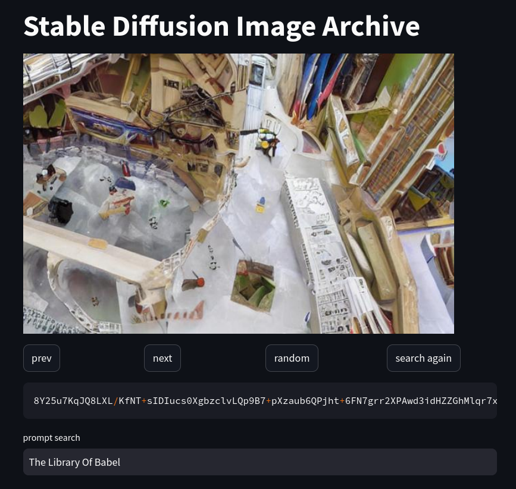

# introduction

This is an attempt for a *"stable diffusion version"* of [babel image archives](http://babelia.libraryofbabel.info/about.html).

The idea is to replace *image locations* with keys encoding the image generation process in a fully deterministic way.


# how to run

1. Create an environment with the requirements installed by running the following in the root folder of the project:
```bash
python -m venv .venv
source .venv/bin/activate
pip install -r requirements.txt
```
2. Launch the API server: 
```bash
fastapi api.py
```
3. Wait that this is ready (should show: "INFO:     Application startup complete.")
4. Launch the app:
```bash
streamlit run app.py
```
5. This should automatically open the app on a tab of a web browser.

# app

The app consists of the following elements:
- a "random" button: generate a random key (image location) and its associated image
- a "prev" and "next" buttons: look up the image corresponding respectively to the previous or the next key from the current one
- a "search again" button: search another image corresponding to the prompt given in the "prompt search" input
- below the buttons: a text area below showing the key (with a copy button on its right side)
- below the the key: a text input to search an image with a specific content, this will find a new key for an image that would be generated with the corresponding text input from the usual stable diffusion generation process.





# technical details

The keys encode different elements of a stable diffusion generation process used to ensure that the result is deterministic:
- the embedding vector for some prompt (887010 bits)
- a seed image (249600 bits)
- the number of inference steps (6 bits)

The keys are base 64 encoded binary strings of total length *189436* (*=(887010+249600+6)/6*).

The bits corresponding to the embedding vector and seed image are converted into 16 bits float. The exponents are encoded within the key with 4 bits instead of 5 with a specific bias for each. This ensures that the length of the key is minimal and the values generated are within the expected model data distribution.


issues:
- no proof that:
  - key to image is injective (esp when using the slideshow can see hardly any difference between images)
  - key to image is surjective on the set of interesting images (what is an interesting image?)
- would get a different library if changed hardware
- can't search for an image (could potentially implement some optimisation loop...)
- image prompt is not always followed


## remarks

- references to image locations ("keys") are much shorter than in the original: around 1,000,000 digits for an image on [https://babelia.libraryofbabel.info] vs ~190,000 on this version.
- despite ensuring full determinism for a single system, the images generated might depend on the system it runs on resulting in different libraries on different systems.
- even though it's using stable diffusion, the random image locations are usually quite boring.
- unfortunately there is no proof/guarantee that several keys wouldn't produce the same image.
- similarly no proof that any interesting image could be reached by choosing the right key.
- it's not possible to search for a specific image but it's possible to try and search for an image with a specific description using the prompt
- descriptions provided in the prompt are sometimes disregarded


# other

This contains a copy of some of Hugging Face's *diffusers* code from [the stable diffusion pipeline](https://github.com/huggingface/diffusers/blob/main/src/diffusers/pipelines/stable_diffusion/pipeline_stable_diffusion.py).


