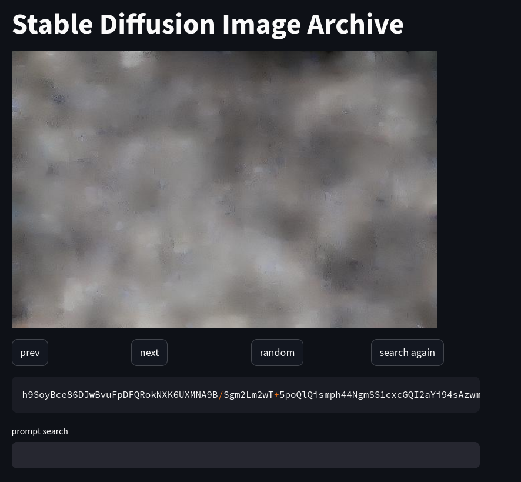
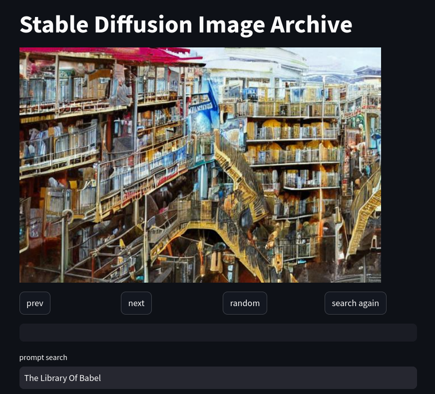

# Introduction

This is an attempt for a stable diffusion version of [babel image archives](http://babelia.libraryofbabel.info/about.html).

The idea is to replace image locations with keys encoding the image generation process in a fully deterministic way.


# How to run

1. Create an environment with the requirements installed by running the following in the root folder of the project:
```bash
python -m venv .venv
source .venv/bin/activate
pip install -r requirements.txt
```
2. Launch the API server: 
```bash
fastapi api.py
```
3. Wait that this is ready (should show: "INFO:     Application startup complete.")
4. Launch the app:
```bash
streamlit run app.py
```
5. This should automatically open the app on a tab of a web browser.

# Desciption of the main app

The app consists of the following elements:
- "random" button: generate a random key and its associated image.
- "prev" and "next" buttons: look up the image corresponding respectively to the previous or the next key from the current one
- "search again" button: search another image corresponding to the prompt given in the "prompt search" input.
- Below the buttons: a text area showing the key (with a "copy" button on its right side).
- Below the the key: a text input to search an image with a specific content, this will find a new key for an image that would be generated with the corresponding text input from the usual stable diffusion generation process.





# Technical details

The keys encode different elements of a stable diffusion generation process used to ensure that the result is deterministic:
- the embedding vector for some prompt (887010 bits)
- a seed image (249600 bits)
- the number of inference steps (6 bits)

The keys are base 64 encoded binary strings of total length 189436.

The bits corresponding to the embedding vector and seed image are converted into 16 bits floats. The exponents are encoded within the key with 4 bits instead of 5 with a specific bias for each. This ensures that the length of the key is minimal and the values generated are within the expected model data distribution.


## Misc.

- References to image locations ("keys") are much shorter than in the original: around 1,000,000 digits for an image on [the Library Of Babel Image Archive](https://babelia.libraryofbabel.info) vs ~190,000 on this version.
- Despite ensuring full determinism for a single system, the images generated might depend on the system it runs on resulting in different libraries on different systems.
- Even though it's using stable diffusion, the random image locations are usually quite boring.
- Unfortunately there is no proof/guarantee that several keys wouldn't produce the same image.
- Similarly, there is no proof that any interesting image could be reached by choosing the right key.
- It's not possible to search for a specific image but it's possible to try and search for an image with a specific description using the prompt.
- Descriptions provided in the prompt are sometimes disregarded.


# Credits

I have lazily copied the generation loop of Hugging Face's *diffusers* code from [the stable diffusion pipeline](https://github.com/huggingface/diffusers/blob/main/src/diffusers/pipelines/stable_diffusion/pipeline_stable_diffusion.py) and modified it a little bit. I have written everything else on my own.


